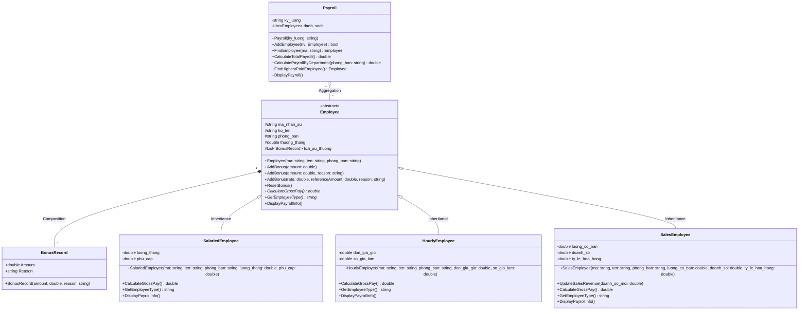

```mermaid
classDiagram
    class BonusRecord {
        +double Amount
        +string Reason
        +BonusRecord(amount: double, reason: string)
    }

    class Employee {
        <<abstract>>
        #string ma_nhan_su
        #string ho_ten
        #string phong_ban
        #double thuong_thang
        #List~BonusRecord~ lich_su_thuong
        +Employee(ma: string, ten: string, phong_ban: string)
        +AddBonus(amount: double)
        +AddBonus(amount: double, reason: string)
        +AddBonus(rate: double, referenceAmount: double, reason: string)
        +ResetBonus()
        +CalculateGrossPay()* double
        +GetEmployeeType()* string
        +DisplayPayrollInfo()
    }

    class SalariedEmployee {
        -double luong_thang
        -double phu_cap
        +SalariedEmployee(ma: string, ten: string, phong_ban: string, luong_thang: double, phu_cap: double)
        +CalculateGrossPay() double
        +GetEmployeeType() string
        +DisplayPayrollInfo()
    }

    class HourlyEmployee {
        -double don_gia_gio
        -double so_gio_lam
        +HourlyEmployee(ma: string, ten: string, phong_ban: string, don_gia_gio: double, so_gio_lam: double)
        +CalculateGrossPay() double
        +GetEmployeeType() string
        +DisplayPayrollInfo()
    }

    class SalesEmployee {
        -double luong_co_ban
        -double doanh_so
        -double ty_le_hoa_hong
        +SalesEmployee(ma: string, ten: string, phong_ban: string, luong_co_ban: double, doanh_so: double, ty_le_hoa_hong: double)
        +UpdateSalesRevenue(doanh_so_moi: double)
        +CalculateGrossPay() double
        +GetEmployeeType() string
        +DisplayPayrollInfo()
    }

    class Payroll {
        -string ky_luong
        -List~Employee~ danh_sach
        +Payroll(ky_luong: string)
        +AddEmployee(nv: Employee) bool
        +FindEmployee(ma: string) Employee
        +CalculateTotalPayroll() double
        +CalculatePayrollByDepartment(phong_ban: string) double
        +FindHighestPaidEmployee() Employee
        +DisplayPayroll()
    }

    Employee "1" *-- "*" BonusRecord : Composition
    Payroll "1" o-- "*" Employee : Aggregation
    Employee <|-- SalariedEmployee : Inheritance
    Employee <|-- HourlyEmployee : Inheritance
    Employee <|-- SalesEmployee : Inheritance
```
